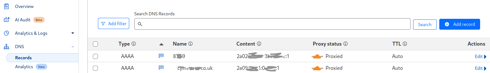

#### Первоначальная настройка VPS

Xray нельзя поставить на "голый" сервер - нужна предварительная подготовка. Нужно создать пользователя, добавить его в группу sudo,
настроить фаервол и перенести порт ssh. Эти действия можно автоматизировать. Для redhat-based дистрибутивов можно использовать скрипты
[init0.sh](misc/init0.sh) и [init1.sh](misc/init1.sh). Скопируйте их на сервер

```
curl -L -o init0.sh https://github.com/EvgenyNerush/easy-xray/raw/main/misc/init0.sh
curl -L -o init1.sh https://github.com/EvgenyNerush/easy-xray/raw/main/misc/init1.sh
```

затем внимательно прочитайте и исправьте по необходимости, и запустите от рута. После нужно зайти в систему от имени нового пользователя и
подготовить необходимые файлы для Cloudflare CDN - если она нужна.


#### Cloudflare CDN

Помимо прямого доступа (для которого достаточно одного IPv4-адреса), можно настроить доступ через сеть доставки контента (content delivery
networn, CDN) от Cloudflare. В этом случае можно проксировать трафик через xray, даже если IP-адрес вашего сервера заблокирован.  Для
настройки прокси через CDN нужно:

- завести бесплатный аккаунт на [cloudflare.com](https://www.cloudflare.com/),
- оплатить серверу второй IP-адрес (IPv6 подойдёт, они обычно дешевле),
- купить доменное имя (наподобие example.com, не важно, где вы его купите).

Доменное имя отдаётся под управление Cloudflare (Websites -> Add a domain), затем добавляется IPv6-адрес вашего сервера (в разделе Websites
кликните на доменное имя, перейдите в DNS/Records и нажмите Add a record).  Для IPv6 адреса создавайте запись типа AAAA, если для доменного
имени example.com создать запись с именем name, то name.example.com будет вести на указанный вами IPv6-адрес. 



В настройках Network нужно включить поддержку gRPC - именно этот протокол позволит использовать xray через CDN. На странице SSL/TLS/Origin
Server создайте сертификаты для связи вашего сервера с сетью CDN (файлы `cert.pem` и `cert.key`). **До запуска установки xray** скопируйте
ваши сертификаты `cert.pem` и `cert.key` в директорию `easy-xray`!

Как работает доступ через CDN? Сети доставки контента задуманы для кеширования больших файлов: если большому числу пользователей в России
хочется посмотреть одно и то же видео, которое есть на сервере в США, гораздо выгоднее один раз скачать это видео на сервер в России (кеш),
и отдавать пользователям с него, чем много раз скачивать из США. В то же время для обхода цензуры нам ничего кешировать не нужно, мы просто
пользуемся возможностью бесплатно доставлять трафик через сервера Cloudflare. Важно, что в такой схеме ваше доменное имя резолвится в
IP-адрес сервера Cloudflare, через который может идти трафик большого количества других сайтов. Поэтому РКН, оценивая сопутствующий ущерб,
может не решиться на блокировку вашего xray сервера, даже если будет о нём знать. Чтобы лучше понять общую концепцию работы xray через CDN,
прочитайте [вот эту статью](https://habr.com/ru/articles/761798/).

#### Easy-xray

После проделанной подготовки установка и настройка xray происходит как обычно, с помощью запуска `sudo ./ex.sh install`.  Vless не может
быть сконфигурирован с fallback при использовании grpc, соответственно, не может противостоять атаке active-probing. Поэтому для
использования CDN скрипт `init0.sh` установит веб-сервер **nginx** - он обеспечит перенаправление на сайт-заглушку. Если вы не использовали
`init0.sh`, установите nginx вручную. Easy-xray сгенерирует "сайт" для nginx, который слушает IPv6 адрес и перенаправляет реальных
пользователей на xray-сервер, слушающий на 127.0.0.1:50051.  Проверить конфигурацию nginx и запустить его можно с помощью команд

```
sudo nginx -t
sudo systemctl enable nginx
sudo systemctl start nginx
```

#### Возможные проблемы и их решения

Если при попытке зайти по доменному имент на ваш "сайт" редирект (fallback) на сайт-заглушку не происходит (error 502, bad gateway),
возможно, политики SELinux запрещают nginx выполнять сетевые соединения. Чтобы это исправить, выполните команду

```
sudo setsebool -P httpd_can_network_connect 1
```

Чтобы посмотреть, какие порты не закрыты фаерволом, можно выполнить

```
sudo firewall-cmd --list-ports
```

Если фаервол закрывает 80 и 443 порты, слудует их открыть:

```
firewall-cmd --permanent --add-port=80/tcp
firewall-cmd --permanent --add-port=443/tcp
firewall-cmd --reload
```

