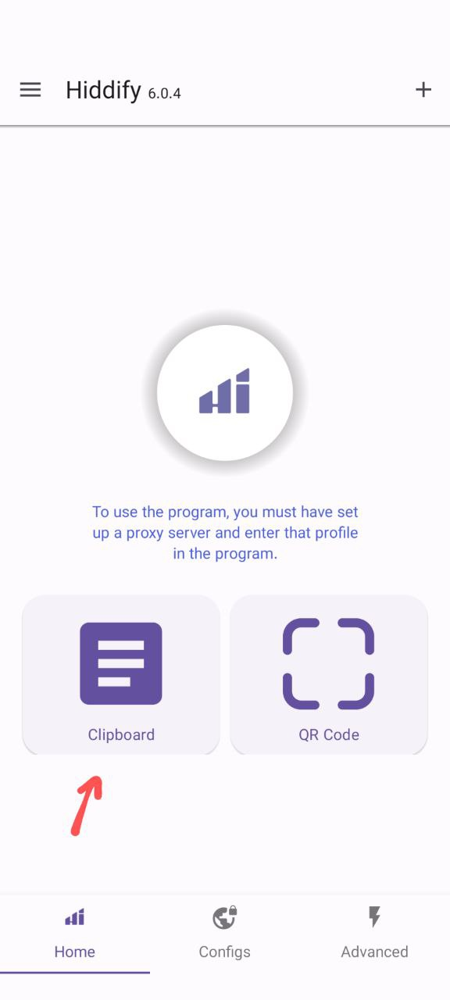
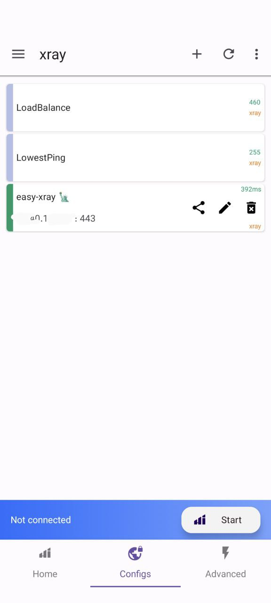
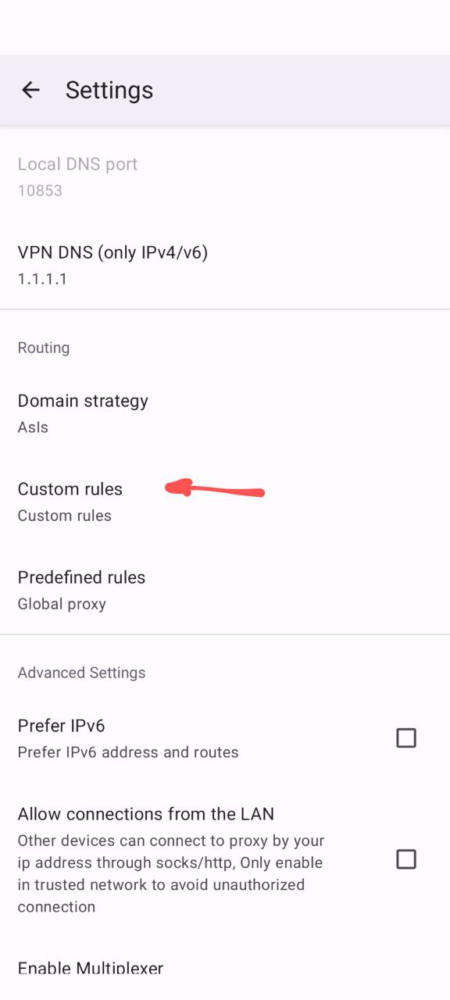
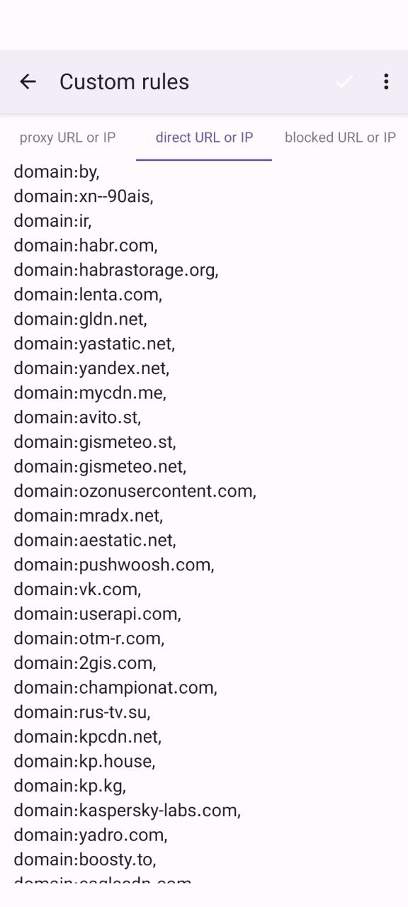

[HiddifyNG in Google Play](https://play.google.com/store/apps/details?id=ang.hiddify.com&pcampaignid=web_share)

Copy config in a form of a link. Open Hiddify app, click Clipboard button, enter any name for a group (e.g. xray), press Confirm. Then click
Configs (on the bottom), you should see "easy-xray" with your server ip. Go to Settings, Custom rules, direct URL or IP section, and paste
the content of `misc/customgeo4hiddify.txt` as plain text. Save, then click to connect/start.

