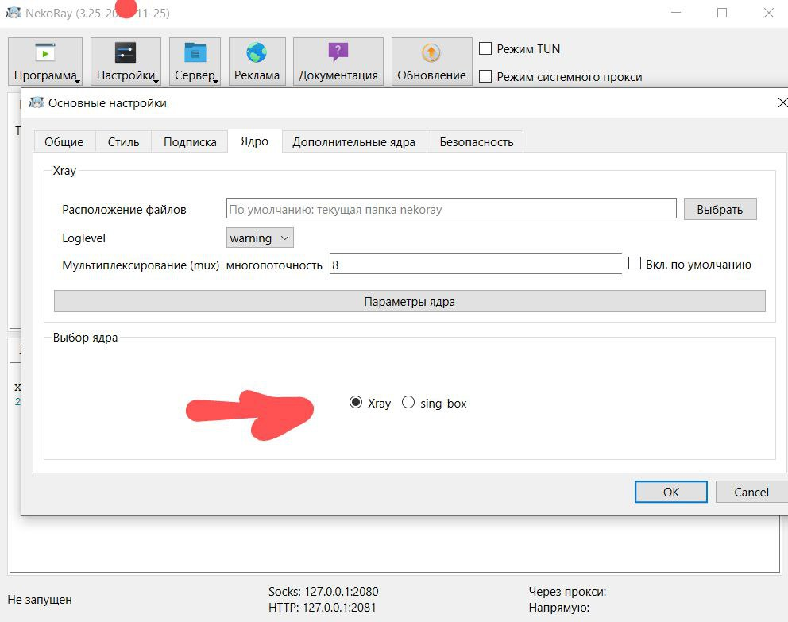
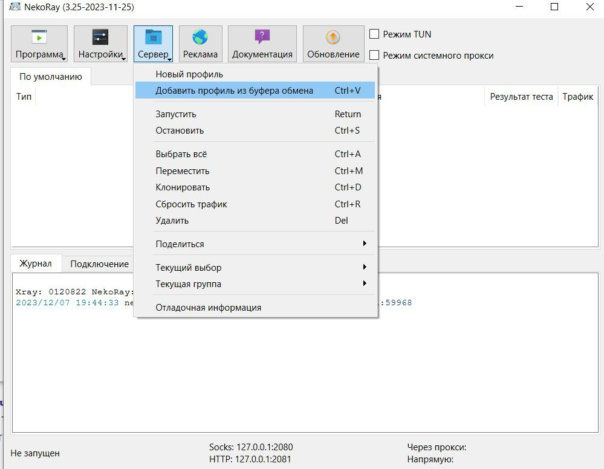
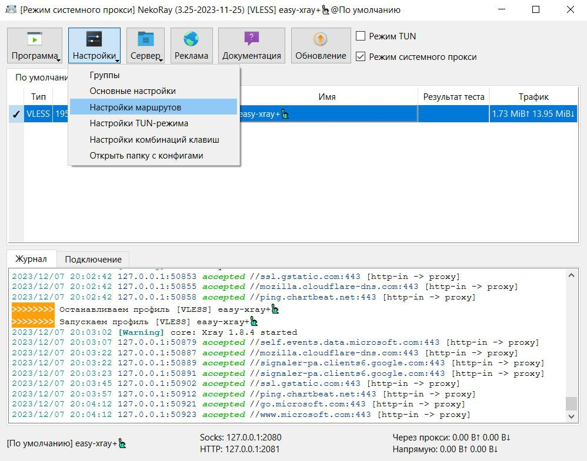
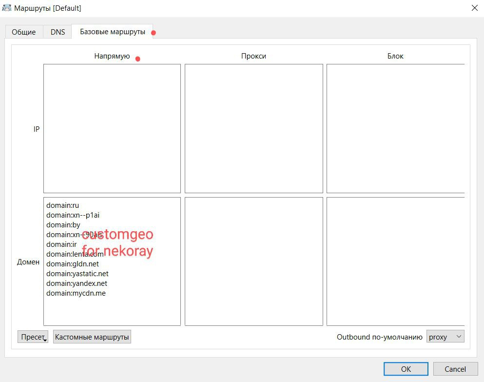
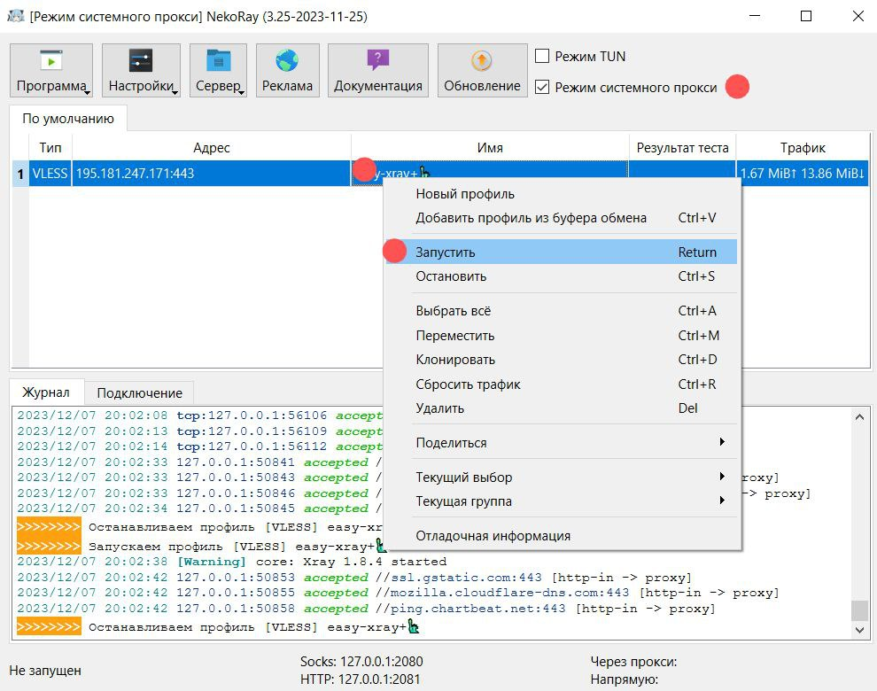

[Nekoray (Nekobox)](https://github.com/MatsuriDayo/nekoray) - клиент с графическим интерфейсом, использующий Qt. Поддерживает Windows и
Linux. Релизы для Windows можно найти на [этой странице](https://github.com/MatsuriDayo/nekoray/releases) в разделе Assets.

Скачиваем, например, `nekoray-3.26-2023-12-09-windows64.zip`, затем распаковываем и запускаем.  Далее выбираем ядро xray, добавляем профиль
(конфиг в форме vless-ссылки), настраиваем маршруты (копируем из
[misc/customgeo4nekoray.txt](https://github.com/EvgenyNerush/easy-xray/blob/main/misc/customgeo4nekoray.txt)), выбираем режим системного
прокси, и запускаем подключение. Если nekoray подключается, но заблокированные сайты не открываются, можно попробовать сменить режим
системного прокси на TUN.

Галочку, соответствующую режиму TUN или режиму системного прокси, к сожалению, приходится ставить каждый раз при запуске nekoray. Если после
завершения nekoray в трее интернет пропадает, завершите nekoray через диспетчер задач.

