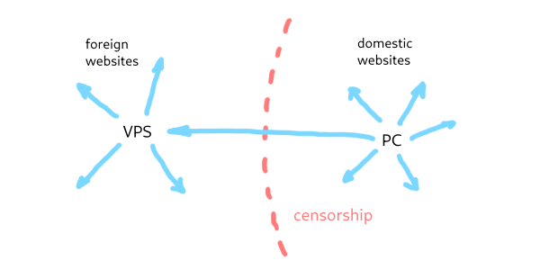
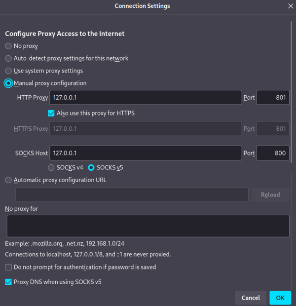

# easy-xray

*Script for Linux which makes XRay management easy*

[Readme in Russian](README.ru.md) [(todo) Readme in Chinese](README.cn.md)

[XRay (aka ProjectX)](https://xtls.github.io/en/) is a frontier solution to circumvent the internet censorship. XRay allows to guide traffic
through a server (VPS) outside the region of censorship as a proxie, but connection to xray server looks for authorities as a typical
connection to a regular website. Attempts to detect VPN such as [active probing](https://ensa.fi/active-probing/) or blocking by the rule
"all except https" are eliminated by XRay.  Also, XRay server can be configured to open only foreign websites, thus preventing detection by
the code on domestic websites.  As a proxy, XRay has no need to encrypt already encrypted https traffic, hence CPU load is low. XRay doesn't
need to keep the connection alive, and users don't need to manually reconnect to it time-to-time. Also users don't need to turn a client off
to go to most domestic websites.



Besides of its plusses, configuration and management of XRay server is quite sophisticated. So, here is a script which helps to do it. It
can

- install/upgrade/remove XRay
- generate credentials and server/client configs
- add/delete users to the configs
- and more

### How to use on VPS

#### Linux

First you need a Linux server (VPS) with [jq](https://jqlang.github.io/jq/) and `openssl` installed, they can be found in repositories of
almost all popular Linux distributions. Then download whole `easy-xray` folder to the VPS, make the script `ex.sh` executable, and run a
desired command with it. Use `./ex.sh help` to see the list of all available commands and `./ex.sh install` to start interactive prompt
that installs and configures XRay.

```
chmod +x ex.sh
./ex.sh help
sudo ./ex.sh install
```

Now you have `conf` folder with server and client configs and some user configs. Server config is properly installed and XRay is running.
Time to share configs or *links* with users! To generate config in the link form, use `./ex.sh link user_config_file.json`.

#### Docker

Script `ex.sh` is written without Docker in mind, but can be used with Docker. Download `easy-xray` folder (main branch) and build the
Docker image from `Dockerfile` with some tag name (-t, say `ximage`):

```
curl -L https://codeload.github.com/EvgenyNerush/easy-xray/tar.gz/main | tar -xz
cd easy-xray-main # note `-main` !!
docker build -t ximage ./
```

Usually user applications are not allowed to bind port 1024 and below, and to mimic a real website xray server should be on ports 80 and
443. Thus allow user applications to use ports from 80 and above:

```
sudo sysctl -w net.ipv4.ip_unprivileged_port_start=80
```

Enable *linger mode* that allows a not-logged user to run long-running services. Otherwise container can come to improper state after your
logout:

```
sudo loginctl enable-linger your_username
```

Then run docker container in interactive mode (`-i -t`) exposing ports 80 and 443 to the ports of the host:

```
docker run -it --name xcontainer -p 80:80 -p 443:443 ximage
```

In the shell of the container install and configure xray. Ignore all warnings about systemd and don't copy configs and don't restart xray.
Start xray with generated server config explicitly:

```
./ex.sh install
xray -c conf/config_server.json
```

Detach from the container with *Ctrl+p then Ctrl+q*. If you need to attach container again, use `docker attach xcontainer` with *Ctrl+c* to
stop xray running, or use `docker exec -it xcontainer bash`. To copy config files from the container to the host, first get container Id:

```
docker ps -a
docker cp 123abc456def:/easy-xray/conf ./
```

Command `./ex.sh link conf_file` can be used on any conputer there config files are stored.

### Clients

#### Linux

XRay itself can be a client, besides plenty of GUI clients that are available for Linux (Nekoray,..) and other popular operating systems
(see below). You can manually install XRay with [official script](https://github.com/XTLS/Xray-install) and manually copy `customgeo.dat` to
`/usr/local/share/xray/` or just install xray and customgeo file with `sudo ./ex.sh install` command. Then, copy client config from the
server and run:

```
sudo cp config_client_username.json /usr/local/etc/xray/config.json
sudo systemctl start xray
```

or

```
sudo xray run -c config_client_username.json
```

In the current configuration, on the client side XRay creates http/https and socks5 proxies on your PC which can be used by your Telegram
app or Web browser like this:



To check that traffic to domestic and foreing sites goes by different ways, visit, for example,
[whatismyip.com](https://www.whatismyip.com/) and [2ip.ru](https://2ip.ru/). They should show different IP addressess.

#### Windows

For Windows GUI clients such as *v2rayN* or *nekoray (nekobox)* can be used.

[V2rayN](https://github.com/2dust/v2rayN/) releases can be found [here](https://github.com/2dust/v2rayN/releases). Download asset with core,
say `v2rayN-With-Core.zip`, unzip, then start. Here is a [graphical instruction for v2rayN](V2RayN.ru.md) (in Russian).

[Nekoray (nekobox)](https://github.com/MatsuriDayo/nekoray) releases can be found on [this
page](https://github.com/MatsuriDayo/nekoray/releases). Choose one of Assets, for instance `nekoray-3.26-2023-12-09-windows64.zip`, download
then unzip it and run Nekoray. Here is a [graphical instruction (in Russian)](Nekoray.ru.md). Try TUN regime in the case of problems; use
task manager to kill it.

#### MacOS

Use XRay:

```
brew install xray
cp customgeo.dat /usr/local/share/xray/ # not yet tested
sudo xray -config=config_client_username.json
```

#### Android

For many mobile applications it is enough to paste a client config in a link form from the buffer, and add customgeo in an appropriate form
(see `misc` dir) to somethere like `Settings/Routing/Custom rules/Direct URL`. Tested applications are listed below.

Use [V2RayNG](https://play.google.com/store/apps/details?id=com.v2ray.ang&pcampaignid=web_share),
[HiddifyNG](https://play.google.com/store/apps/details?id=ang.hiddify.com&pcampaignid=web_share) or [Hiddify
Next](https://play.google.com/store/apps/details?id=app.hiddify.com&pcampaignid=web_share). They are very similar to each other, here are
some instructions for [V2RayNG (RU)](V2RayNG.ru.md) and [HiddifyNG (EN)](HiddifyNG.en.md).

#### iOS

Use [Straisand](https://apps.apple.com/us/app/streisand/id6450534064). Its configuration is very similar to that of V2Ray and Hiddify, here
is the [instruction for Straisand](Straisand.md).

#### Others

[Here](https://github.com/xtls/xray-core) you can find an additional list of clients.

### Tor

Most of GUI clients are based on xray core, but do not fully support its configuration, that is crutial for Tor. To use
[TorBrowser](https://www.torproject.org/download/) in this case, use bridges. To turn on a bridge, go to Settings/Connection, then to
Bridges section and choose a built-in obfs4 bridge.

### Bittorrent

Bittorent protocol is blocked in the current configuration. Using bittorent on a VPS can lead to a ban from VPS provider.

### What else

#### Hints

To choose a good `serverName` (your VPS will mimic this website), you can use [RealiTLScanner](https://github.com/XTLS/RealiTLScanner). This
tool scans ip addresses near your server (do it not from your VPS!) and show names found at port 443. With `nmap -T4 hostname` you can check
that only ports 80 and 443 are open on hosts of the found websites (as in the configurations of template configs). It is also good to move
ssh on your VPS to a port beyond 1024. It can be done in `/etc/ssh/sshd_config`. Check twice that VPS is available at your new port before
you comment Port 22!

```
#Port 22
Port 43210
```

#### Links

Template configs contain comments and links and are a good start to find another interesting Xray configuration options.

See [this link](https://github.com/EvgenyNerush/coherence-grabber) for details on how `customgeo` files are generated.

[This article (in Russian)](https://habr.com/ru/articles/731608/) helped me to install XRay for the first time.

The template configs are based on these [gRPC](https://github.com/XTLS/Xray-examples/tree/main/VLESS-gRPC-REALITY)
and [XTLS](https://github.com/XTLS/Xray-examples/tree/main/VLESS-TCP-XTLS-Vision-REALITY) examples.

[XRay config reference](https://xtls.github.io/en/config/) is brilliant and helped me much.

