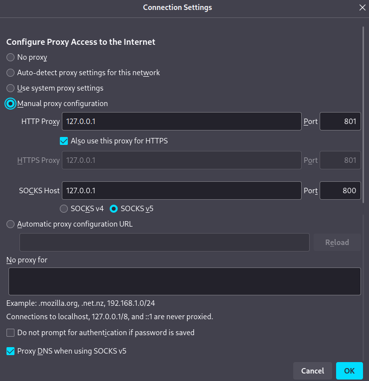

# easy-xray

*Script for Linux which makes XRay installation and configuration easy*

(todo) [Readme in Russian](README.ru.md)

(todo) [Readme in Chinese](README.cn.md)

[XRay (aka ProjectX)](https://xtls.github.io/en/) is a frontier solution to surpass the internet censorship. It can work as a server and as
a client allowing to guide traffic through a VPS outside the region of censorship. XRay configuration can be confusing for a newcomer,
so, here is a script which helps to

- install/upgrade/remove XRay and geodata
- generate credentials and server/client configs
- add/delete users to the configs

First, make the script `ex.sh` executable, then run a desired command with it. Use `./ex.sh help` to see the list of all available commands
and `./ex.sh install` to start interactive prompt which installs and configures XRay.
```
$ chmod +x ex.sh
$ ./ex.sh help
$ sudo ./ex.sh install
```

### Prerequisites

For manipulations with configs, [jq](https://jqlang.github.io/jq/) is needed, it can be found in repositories of almost all popular Linux
distributions.

### How it works

With current configs, XRay creates a tunnel between the client (your laptop, phone etc.) and the server (your VPS). The tunnel uses VLESS
[Reality](https://github.com/XTLS/REALITY/blob/main/README.en.md) protocol that obfuscates traffic and in our case imitates
[grpc](https://en.wikipedia.org/wiki/GRPC). For the censor the tunnel looks like a usual connection to a site. The server responds to https
requests as some popular site thus it is not suspicious for an active probing. On the client side *XRay* creates http/https and socks
proxies which can be used by your Telegram or web browser like this:



Note that there is no additional encryption layer in VLESS; using it you rely on the encryption that the browser (Telegram app etc.) makes.
Note also that for current client config, traffic to .cn, .ru, .by and .ir sites goes directly from the client, see
[here](https://github.com/EvgenyNerush/coherence-grabber) for details. This makes your server much less attention-grabbing and suspicious,
but your connection less anonymous.

### Other clients

For Windows, MacOS or Android you can try Nekobox, v2rayNG or ? (TODO): tests and config generation for them.

### Futher reading

Template configs contain comments and links and are good start to find another interesting Xray configuration options.

### Acknowledgements

[This article (in Russian)](https://habr.com/ru/articles/731608/) helped me to install *XRay* for the first time.

[XRay config reference](https://xtls.github.io/en/config/) is brilliant and helped me much.

Configs for [gRPC](https://github.com/XTLS/Xray-examples/tree/main/VLESS-gRPC-REALITY)
and [XTLS](https://github.com/XTLS/Xray-examples/tree/main/VLESS-TCP-XTLS-Vision-REALITY) on that the template configs are based.

