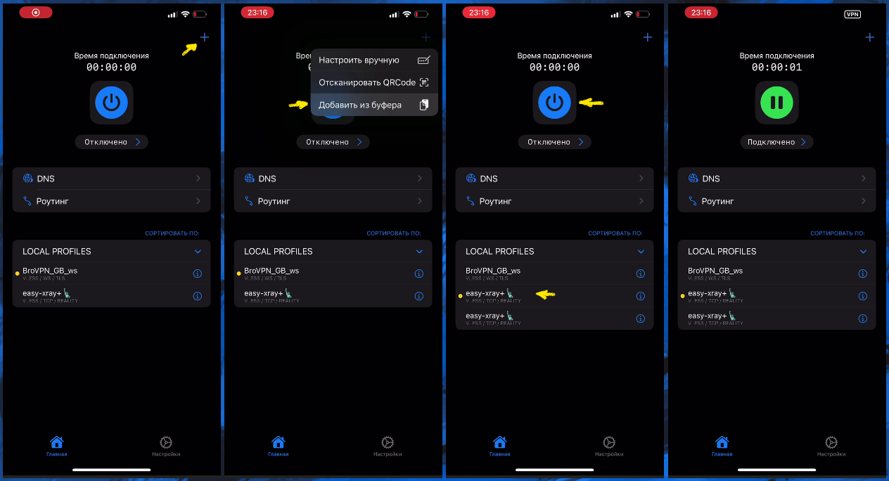
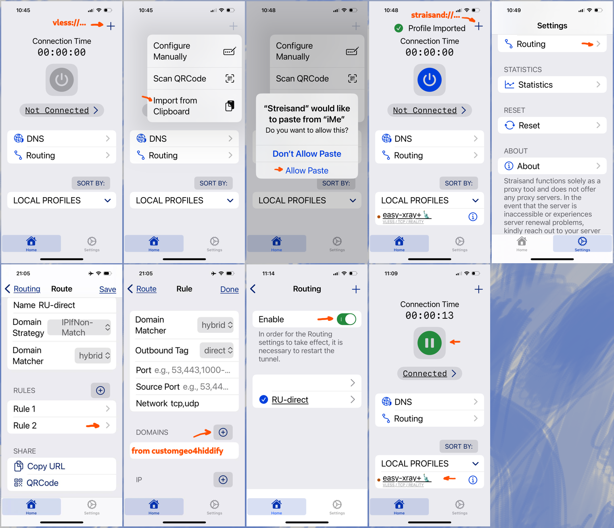

[Straisand in App Store](https://apps.apple.com/us/app/streisand/id6450534064).

Without direct access to Chinese, Russian and Iranian websites from customgeo list, all the configuration is just copy-paste of config in
form of url-link (`vless://...`):



To add customgeo rules for direct access, first press "+" (in right-up corner) and paste url-link with straisand app configuration:

```
streisand://aW1wb3J0L3JvdXRlOi8vWW5Cc2FYTjBNRERWQVFJREJBVUdEaGdaR2xWeWRXeGxjMTFrYjIxaGFXNU5ZWFJqYUdWeVZHNWhiV1ZlWkc5dFlXbHVVM1J5WVhSbFozbFVkWFZwWktJSEU5VUlDUW9MREEwT0R4QVNXMjkxZEdKdmRXNWtWR0ZuWFdSdmJXRnBiazFoZEdOb1pYSldaRzl0WVdsdVVtbHdWMjVsZEhkdmNtdFdaR2x5WldOMFZtaDVZbkpwWktDaEVWaG5aVzlwY0RweWRWZDBZM0FzZFdSdzFCUVZDZ3dORGhZU1cyOTFkR0p2ZFc1a1ZHRm5YV1J2YldGcGJrMWhkR05vWlhLaEYxbGtiMjFoYVc0NmNuVlpVbFV0WkdseVpXTjBYRWxRU1daT2IyNU5ZWFJqYUY4UUpFUkROVGxETXpsRExVUXdSRVl0TkRsR015MDVRVEl3TFVFMlJUVkVSakkwUkRaRE9RQUlBQk1BR1FBbkFDd0FPd0JBQUVNQVRnQmFBR2dBYndCeUFIb0FnUUNJQUlrQWl3Q1VBSndBcFFDeEFMOEF3UURMQU5VQTRnQUFBQUFBQUFJQkFBQUFBQUFBQUJzQUFBQUFBQUFBQUFBQUFBQUFBQUVK
```

Then go to Settings/Routing, Rule 2 and instead of `domains:ru` paste to DOMAINS text from
[customgeo4hiddify.txt](https://github.com/EvgenyNerush/easy-xray/blob/main/misc/customgeo4hiddify.txt), turn on routing and connect.



