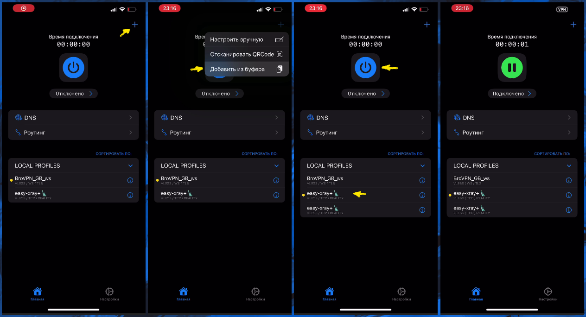

[Straisand в App Store](https://apps.apple.com/us/app/streisand/id6450534064).

В простейшем случае, без настройки прямого доступа до российских и китайских сайтов по списку customgeo, вся настройка сводится к
копированию конфига в форме url-ссылки (`vless://...`) и вставке её из буфера обмена в Straisand:



Для добавления "прямых" маршрутов для сайтов из списка customgeo нужно настроить правила, добавив через "+" (справа вверху) url-ссылку с
настройками straisand:

```
streisand://aW1wb3J0L3JvdXRlOi8vWW5Cc2FYTjBNRERWQVFJREJBVUdEaGdaR2xWeWRXeGxjMTFrYjIxaGFXNU5ZWFJqYUdWeVZHNWhiV1ZlWkc5dFlXbHVVM1J5WVhSbFozbFVkWFZwWktJSEU5VUlDUW9MREEwT0R4QVNXMjkxZEdKdmRXNWtWR0ZuWFdSdmJXRnBiazFoZEdOb1pYSldaRzl0WVdsdVVtbHdWMjVsZEhkdmNtdFdaR2x5WldOMFZtaDVZbkpwWktDaEVWaG5aVzlwY0RweWRWZDBZM0FzZFdSdzFCUVZDZ3dORGhZU1cyOTFkR0p2ZFc1a1ZHRm5YV1J2YldGcGJrMWhkR05vWlhLaEYxbGtiMjFoYVc0NmNuVlpVbFV0WkdseVpXTjBYRWxRU1daT2IyNU5ZWFJqYUY4UUpFUkROVGxETXpsRExVUXdSRVl0TkRsR015MDVRVEl3TFVFMlJUVkVSakkwUkRaRE9RQUlBQk1BR1FBbkFDd0FPd0JBQUVNQVRnQmFBR2dBYndCeUFIb0FnUUNJQUlrQWl3Q1VBSndBcFFDeEFMOEF3UURMQU5VQTRnQUFBQUFBQUFJQkFBQUFBQUFBQUJzQUFBQUFBQUFBQUFBQUFBQUFBQUVK
```

Затем в настройках маршрутов Settings/Routing переходим к Rule 2 и вместо `domains:ru` вставляем в DOMAINS текст из
[customgeo4hiddify.txt](https://github.com/EvgenyNerush/easy-xray/blob/main/misc/customgeo4hiddify.txt). Далее включаем роутинг и
подсоединяемся к нашему серверу.


