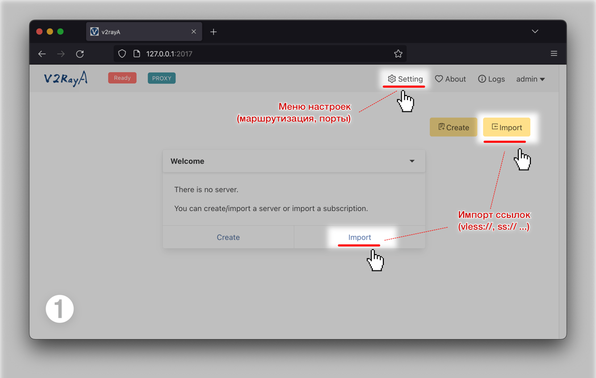
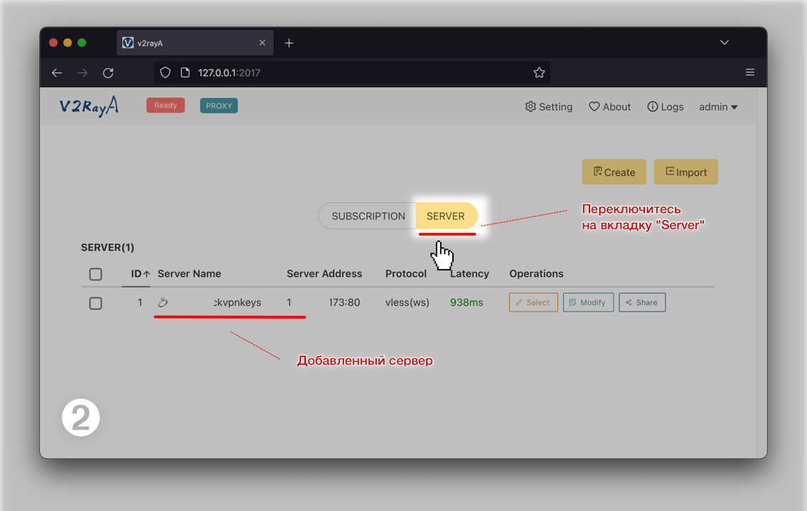
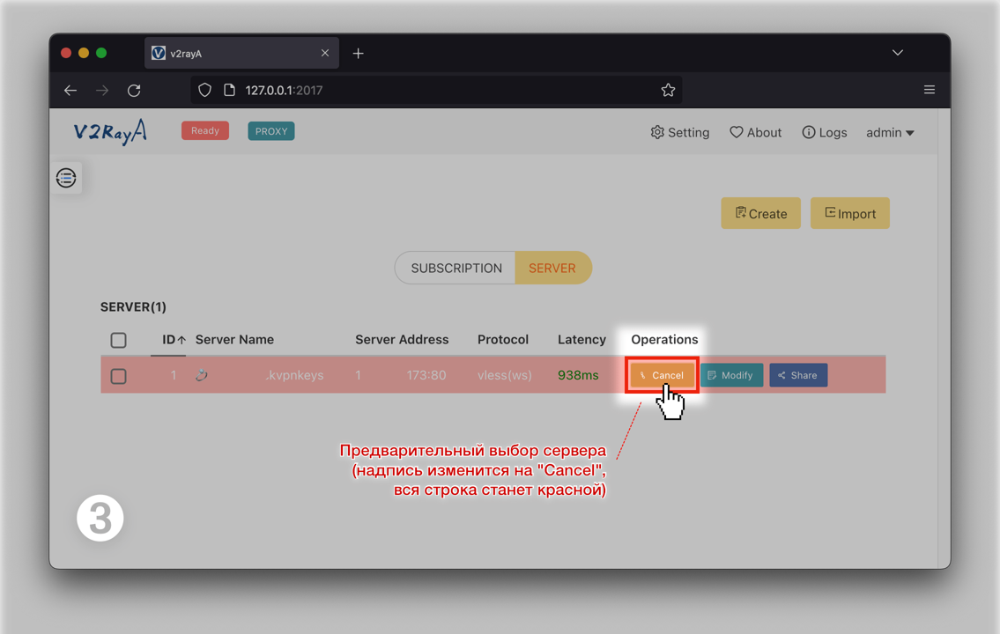
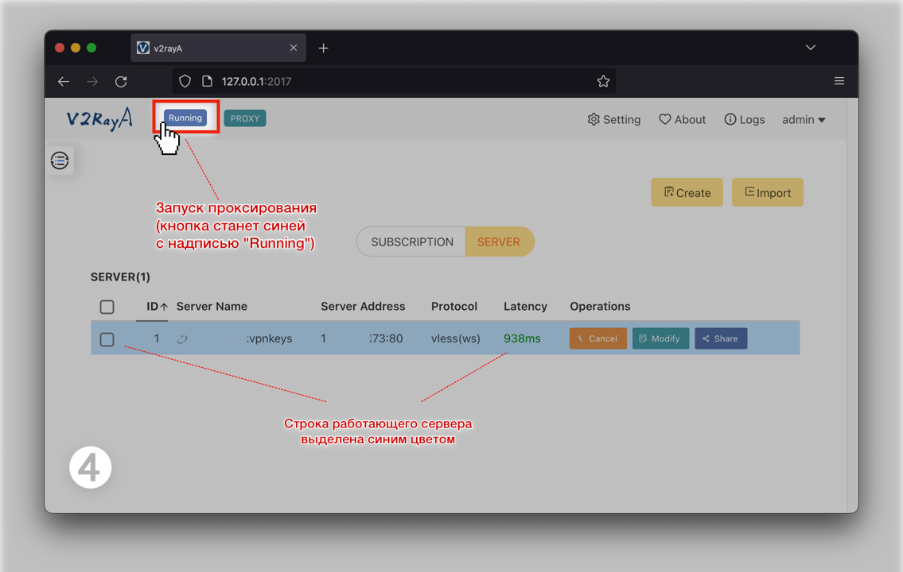
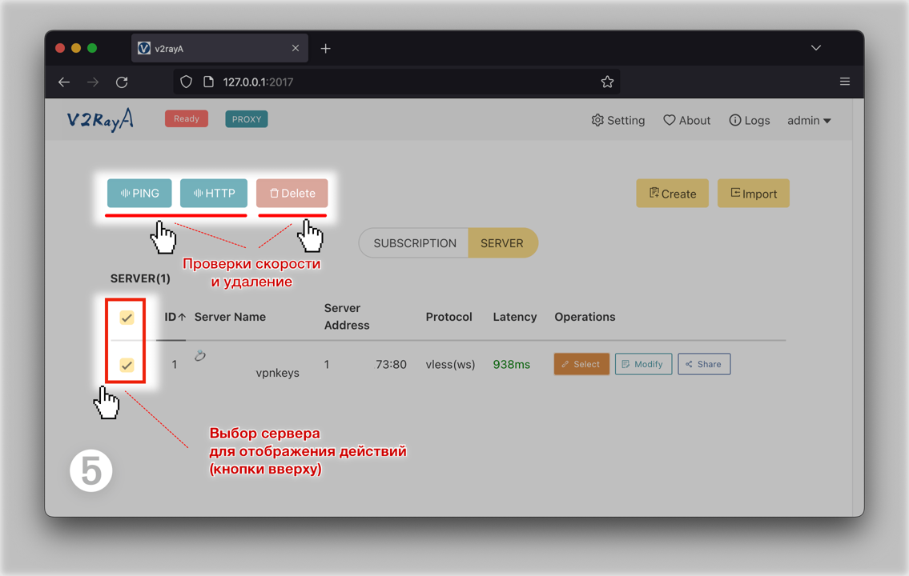

**[v2rayA](https://v2raya.org/en/)** - не заслуженно малоизвестный, хотя и весьма функциональный клиент для движков/ядер [Xray-core](https://github.com/XTLS/Xray-core) и [V2Ray](https://github.com/v2fly/v2ray-core). 

Имеет унифицированный для всех платформ веб-интерфейс (подход one-size-fits-all, т.е. на все случаи).


## Ссылки на ресурсы
 - [Главная станица проекта](https://v2raya.org/en/)
 - **Документация:** [установка и настройка](https://v2raya.org/en/docs/prologue/introduction/)
 - Релизы на **GitHub** под [разные платформы](https://github.com/v2rayA/v2rayA/releases)
 - Настройка под **OpenWRT**: [cтатья на Хабре](https://habr.com/ru/articles/773696/) 

 
## Описание
Программа имееся в большинстве дистрибутивов [Linux](https://v2raya.org/en/docs/prologue/installation/linux/), есть инсталлятор для [Windows](https://v2raya.org/en/docs/prologue/installation/windows/), пакет для [MacOS](https://v2raya.org/en/docs/prologue/installation/macos/).

При желании можно настроить руками с нуля – подробная процедура установки описана в [документации](https://v2raya.org/en/docs/prologue/introduction/).

Умеет автоматически создавать **transparent proxy** в Linux-системах (т.е. прописывать за пользователя требуемые правила **iptables/nftables** с использованием методов **TProxy/Redirect**). 

Инсталлятор под Windows позволяет установить как системную службу с автозапуском в 2 клика.

Написан на Go, не имеет внешних зависимостей (помимо ядра [Xray-core](https://github.com/XTLS/Xray-core) / [V2Ray](https://github.com/v2fly/v2ray-core)). Не требуется предварительная настройка среды запуска, веб-ресурсы вшиты в единственный бинарник. 

> [!NOTE]
> Из-за слегка неряшливого интерфейса **[v2rayA](https://v2raya.org/en/)** сперва может показаться не слишком серьезной программой. Тем не менее, стабильность работы и реализация основного функционала на высоте.

### Преимущества:
 - [x] Кроссплатформенный унифицированный веб-интерфейс.
 - [x] Инсталлятор Windows и пакеты/бинарники для множества дистрибутивов [**Linux**](https://v2raya.org/en/docs/prologue/installation/linux/), [**OpenWrt**](https://v2raya.org/en/docs/prologue/installation/openwrt/) и [**Docker**](https://v2raya.org/en/docs/prologue/installation/docker/), [**MacOS**](https://v2raya.org/en/docs/prologue/installation/macos/) ([Homebrew](https://brew.sh/)).
 - [x] Сохранение настроек после перезагрузки сервиса.
 - [x] Подробная [документация](https://v2raya.org/en/docs/prologue/introduction/) со множеством примеров.
 - [x] Поддержка свежих ядер [**Xray-core**](https://github.com/XTLS/Xray-core/releases) / [**V2Ray**](https://github.com/v2fly/v2ray-core/releases) + пользовательские [Geosite](https://github.com/Skrill0/AntiFilter-Domains/releases)/[GeoIP](https://github.com/Skrill0/AntiFilter-IP/releases).
 - [x] Способность работать как системный фоновый сервис в [Windows](https://v2raya.org/en/docs/prologue/installation/windows/#running-in-the-background), [MacOS](https://v2raya.org/en/docs/prologue/installation/macos/#create-service-files), [Linux](https://v2raya.org/en/docs/prologue/installation/linux/#systemd-services).
 - [x] Автоматическая настройка режима [**прозрачного прокси**](https://v2raya.org/en/docs/prologue/quick-start/#transparent-proxy)/роутера для LAN.
 - Упрощенный синтаксис пользовательских правил маршрутизации ([**RoutingA**](https://v2raya.org/en/docs/manual/routinga/)).

## Порты

| Служба     | Номер порта |
|------------|-------------|
| **Web UI** | 2017        |
| **SOCKS5** | 20170       |
| **HTTP**   | 20171       | 


## Основные экраны

### ➊ Начальный экран с кнопками импорта ссылок-ключей


### ➋ Вкладка "Server"


### ➌ Предварительный выбор добавленного сервера


### ➍ Запуск прокси


### ➎ Проверки скорости и удаление сервера


### ➏ Экраны настроек, правил маршрутизации ([RoutingA](https://v2raya.org/en/docs/manual/routinga/))


## Замена ядра [V2ray](https://github.com/v2fly/v2ray-core/releases) на [Xray-core](https://github.com/XTLS/Xray-core/releases)

Клиент **[v2rayA](https://v2raya.org/en/)**  поставляется с устаревшим ядром [V2Ray](https://github.com/v2fly/v2ray-core), но без проблем поддерживает актуальные версии ядра [Xray-core](https://github.com/XTLS/Xray-core) (со всеми его фичами вроде [VLESS Reality](https://habr.com/ru/articles/731608/), [XTLS‑Vision](https://habr.com/ru/articles/728836/)).

>  [!NOTE] Установленное ядро [Xray-core](https://github.com/XTLS/Xray-core) получает приоритет над штатным ядром [V2Ray](https://github.com/v2fly/v2ray-core). 

### Варианты замены ядра на Xray
**Вариант 1:** установить пакет Xray-core в вашей системы - **[v2rayA](https://v2raya.org/en/)** его должен сам найти и начать использовать. 

**Вариант 2:** Скачать [Xray-core](https://github.com/XTLS/Xray-core/releases) вручную и поместить исполняемый файл в одну из папок, список которых приведен ниже для разных ОС: 

**Пути к папкам с ядрами Xray/V2Ray:**

 - **Windows:** `/Program Files/v2rayA/bin/`
 - **MacOS:** `/usr/local/bin/`
 - **OpenWRT:** `/usr/bin/xray/`

>  [!NOTE] После замены штатное ядро V2ray можно удалить.


# Установка в Windows
 - Страница [документации](https://v2raya.org/en/docs/prologue/installation/windows)
 - Инсталлятор на [GitHub](https://github.com/v2rayA/v2rayA/releases)

Можно установить также при помощи пакетных менеджеров для Windows:

#### [WinGet:](https://github.com/microsoft/winget-cli)

```
winget install --id v2rayA.v2rayA
```

#### [Scoop:](https://scoop.sh)

```
scoop bucket add v2raya https://github.com/v2rayA/v2raya-scoop
scoop update
scoop install v2raya
```


# Установка в MacOS

 - Страница [документации](https://v2raya.org/en/docs/prologue/installation/macos/)
   
Рекомендуемый способ установки: при помощи пакетного менеджера [Homebrew](https://brew.sh), который стал de facto стандартом для MacOS.


```
brew tap v2raya/v2raya
brew install v2raya/v2raya/v2raya
brew services start v2raya
```

Хотя ручная установка также [описывается в документации](https://v2raya.org/en/docs/prologue/installation/macos/#manual-installation), но несколько затруднена спецификой назначения прав запуске служб в MacOS.

# Установка в Linux
Пакет **[v2rayA](https://v2raya.org/en/)** уже имеется в большинстве дистрибутивов ([Ubuntu](https://snapcraft.io/v2raya), [Debian](https://v2raya.org/en/docs/prologue/installation/debian/), [Docker](https://v2raya.org/en/docs/prologue/installation/docker/), [OpenWRT](https://v2raya.org/en/docs/prologue/installation/openwrt/), [Arch](https://v2raya.org/en/docs/prologue/installation/archlinux/), [RedHat](https://v2raya.org/en/docs/prologue/installation/redhat/), [OpenSUSE](https://v2raya.org/en/docs/prologue/installation/redhat/)) и устанавливается без каких-либо особенностей.


