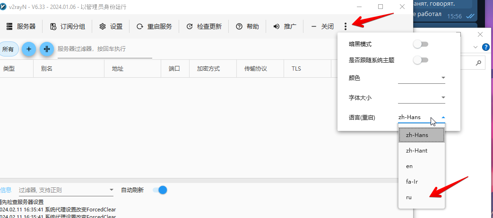
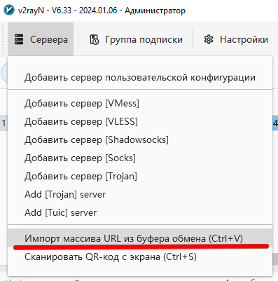
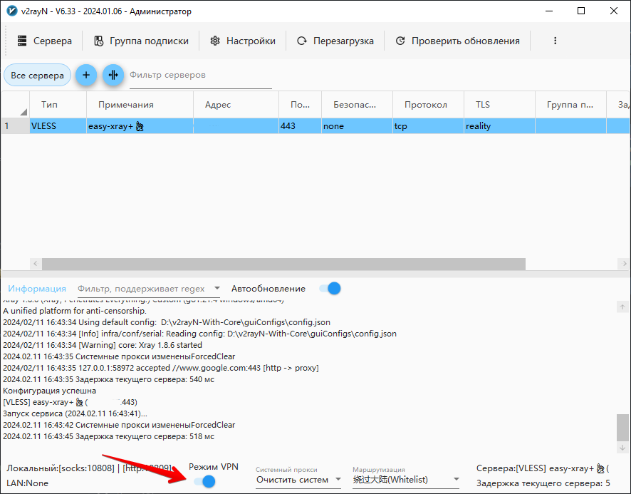
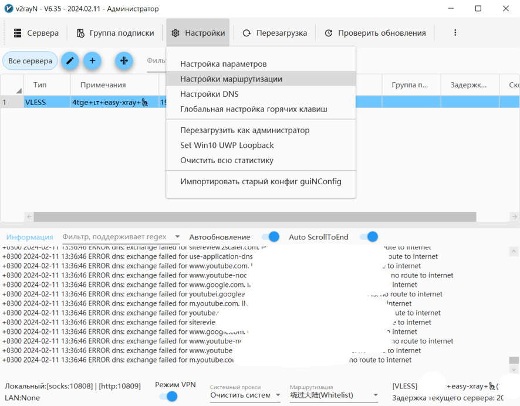
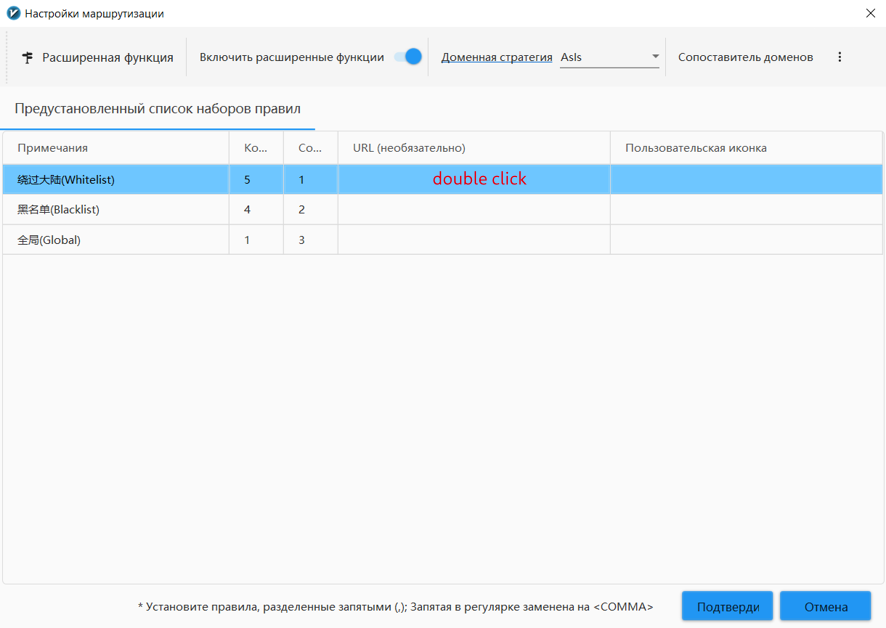
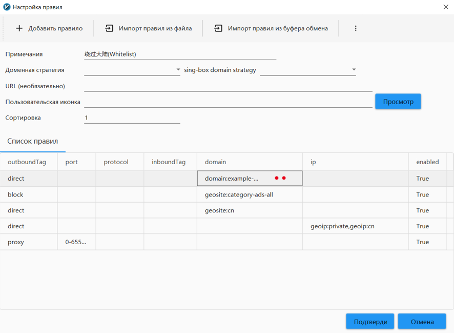
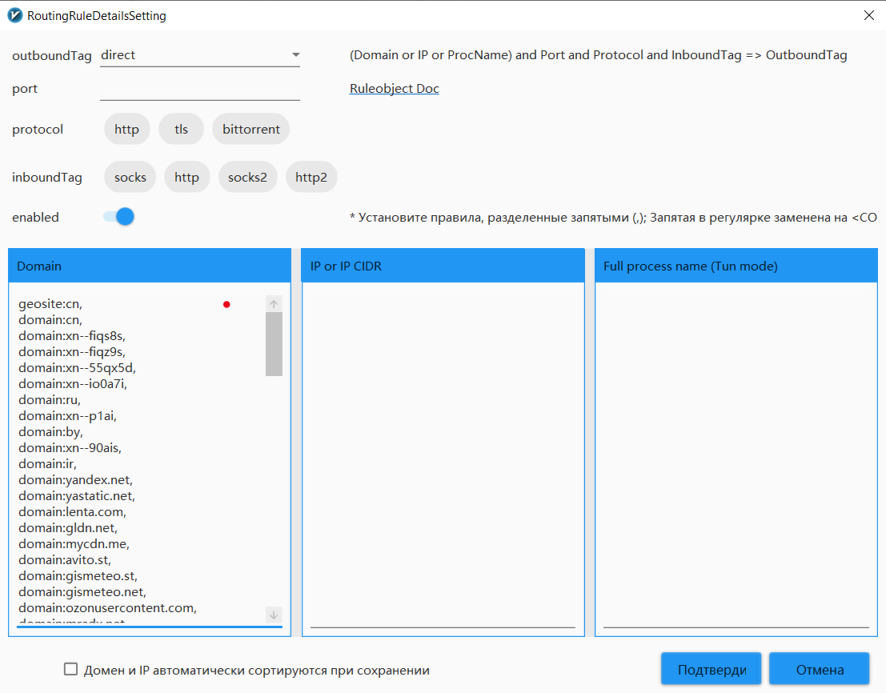

[V2rayN](https://github.com/2dust/v2rayN/) - клиент под Windows с графическим интерфейсом. Релизы можно найти
[здесь](https://github.com/2dust/v2rayN/releases). Загрузите и распакуйте один из Assets с ядром (например `v2rayN-With-Core.zip`),
запустите.
Затем поменяйте язык приложения (в правом верхнем углу, см. картинки), подождите - приложение скачает геобазы, перезапустите приложение
(выключить его можно в трее). Теперь можно вставить конфиг в виде url-ссылки (`vless://...`), подключиться и включить режим VPN (кнопка
внизу, если она не отображается, перезапустите программу от имени администратора). Содержимое
[misc/customgeo4v2rayNwin.txt](https://github.com/EvgenyNerush/easy-xray/blob/main/misc/customgeo4v2rayNwin.txt) вставляем в Whitelist.
V2rayN чувствителен к символам окончания строк, поэтому не вставляйте в него customgeo4hiddify.txt.

