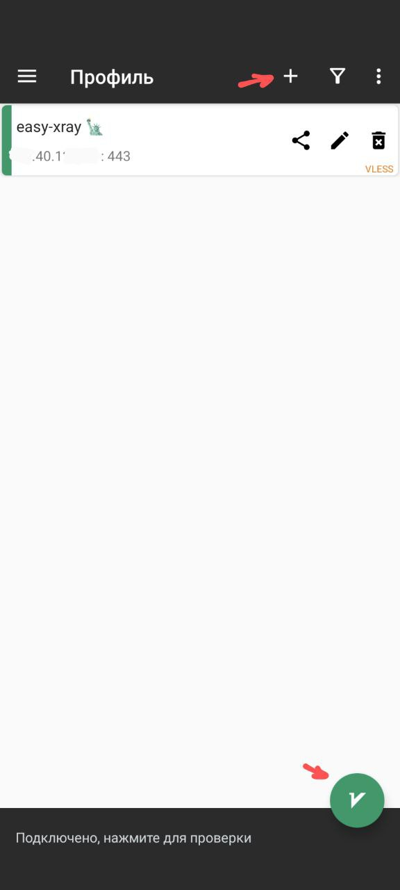
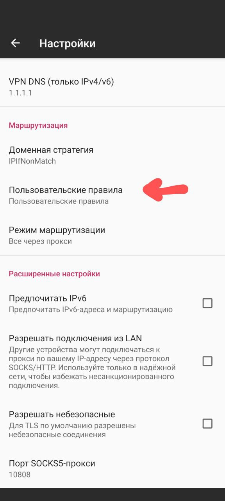
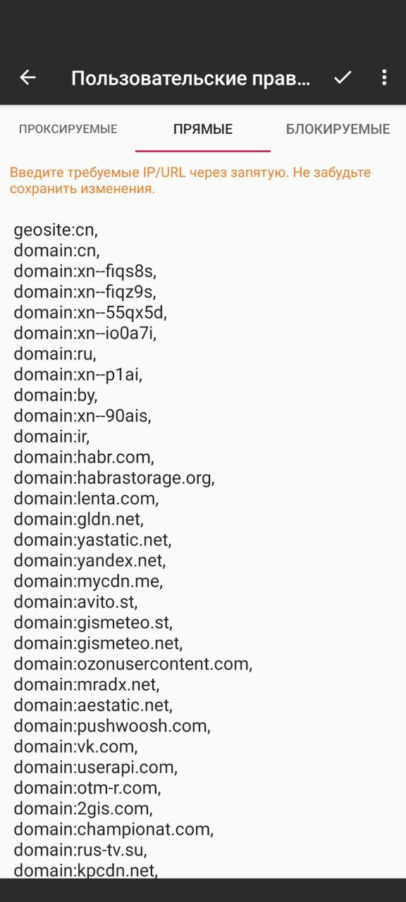

[V2RayNG в Google Play](https://play.google.com/store/apps/details?id=com.v2ray.ang&pcampaignid=web_share)

Конфиг-ссылку нужно скопировать и добавить в приложение ("+" справа вверху, далее импорт профиля из буфера обмена).  Для нормальной работы
российских сайтов нужно скопировать содержимое
[misc/customgeo4hiddify.txt](https://github.com/EvgenyNerush/easy-xray/blob/main/misc/customgeo4hiddify.txt) в пользовательские правила
(прямые). Если V2RayNG подключается, но браузер работает с перебоями или вообще не загружает сайты, попробуйте удалить в настройках V2Ray
поле VPN DNS (Настройки -> Настройки VPN -> VPN DNS (только IPv4/v6), оставить поле пустым, нажать Ok).

