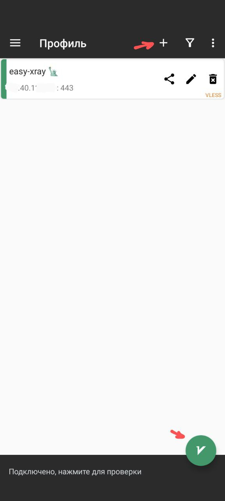
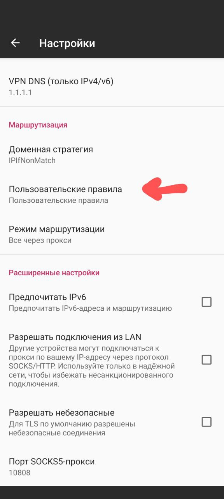
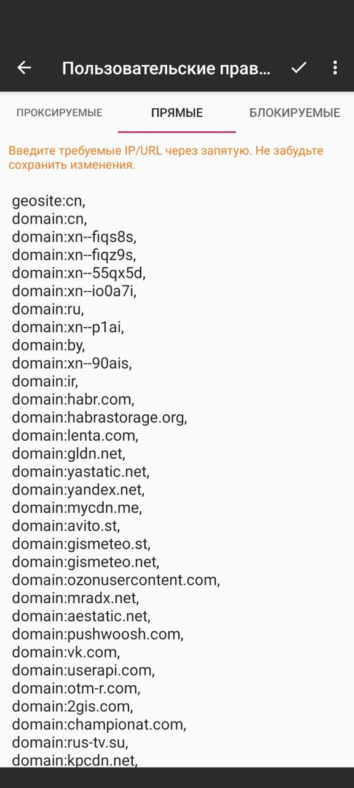
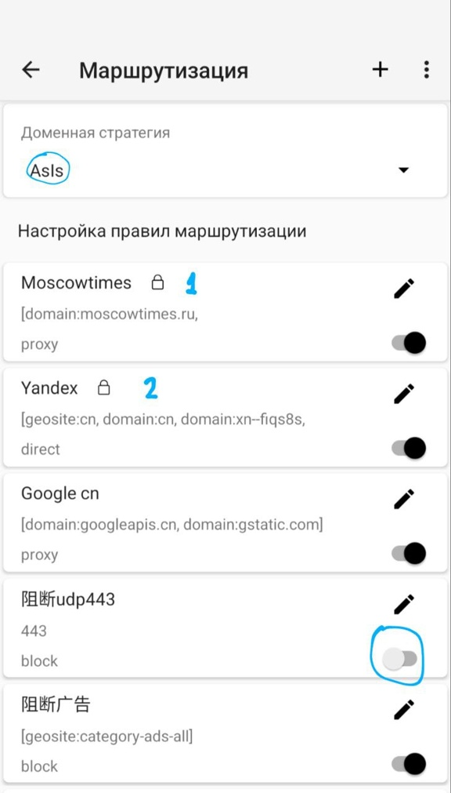

[V2RayNG в Google Play](https://play.google.com/store/apps/details?id=com.v2ray.ang&pcampaignid=web_share)

Конфиг-ссылку нужно скопировать и добавить в приложение ("+" справа вверху, далее импорт профиля из буфера обмена).  Если V2RayNG
подключается, но браузер работает с перебоями или вообще не загружает сайты, попробуйте удалить в настройках V2RayNG поле VPN DNS (Настройки
-> Настройки VPN -> VPN DNS (только IPv4/v6), оставить поле пустым, нажать Ok).

В настройках VPN можно выбрать пункт "Прокси для выбранных приложений". В нём можно выбрать приложения, трафик которых следует пускать через
прокси-сервер (флажок "режим обхода" при этом нужно оставить в положении "выключен").

Для нормальной работы российских сайтов нужно создать два новых правила маршрутизации (для создания правила в меню "Маршрутизация" нужно
нажать "+"). Первое - для проксирования сайтов, использующиx домен .ru, но заблокированных в России. Список таких сайтов можно скопировать
из [misc/customgeo-exceptions-4hiddify.txt](https://github.com/EvgenyNerush/easy-xray/blob/main/misc/customgeo-exceptions-4hiddify.txt), при
этом нужно выбрать тип исходящего подключения "proxy" (прокси). Второе правило маршрутизации нужно создать для подключения к российским
сайтам напрямую. Для этого можно использовать список доменов из
[misc/customgeo4hiddify.txt](https://github.com/EvgenyNerush/easy-xray/blob/main/misc/customgeo4hiddify.txt), при этом нужно выбрать тип
исходящего подключения "direct" (прямое). Кроме самих правил, важен их порядок. Поднимите созданные вами правила наверх, чтобы
первое правило (для проксирования, на картинке - Moscowtimes) было выше второго (для прямого доступа, на картинке - Yandex), и чтобы они
были выше всех остальных правил.

Для работы голосовых чатов (Discord) может потребоваться выключить правило маршрутизации udp443, блокирующее протокол UDP.

Для того, чтобы Tor Browser мог подключаться через v2rayng, нужно в Маршрутизации v2rayng доменную стратегию сменить на "AsIs".

