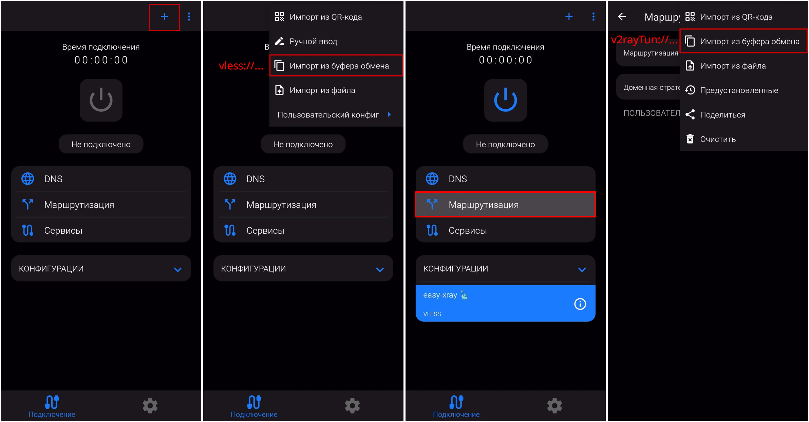

[v2RayTun в AppStore](https://apps.apple.com/ru/app/v2raytun/id6476628951)

[v2RayTun в Google Play](https://play.google.com/store/apps/details?id=com.v2raytun.android)

Приложение доступно как для Android, так и для iOS, однако версии незначительно отличаются друг от друга.

Следуйте инструкции ниже (на примере Android-версии). Обратите внимание, что на последнем кадре необходимо вставить набор правил, зависящий от вашей платформы.



### Android

[android]::
```
[{"domain":["domain:moscowtimes.ru","domain:kasparov.ru","domain:novayagazeta.ru","domain:grani.ru","domain:newtimes.ru","domain:tvrain.ru","domain:the-village.ru","domain:arsvest.ru","domain:zasekin.ru","domain:trv-science.ru","domain:snob.ru","domain:colta.ru","domain:newizv.ru","domain:itsmycity.ru","domain:theins.ru","domain:4pda.ru","domain:abook-club.ru","domain:appstorrent.ru","domain:ej.ru","domain:onlinesim.ru","domain:republic.ru","domain:sobesednik.ru","domain:habr.com","domain:habrastorage.org","domain:onlinesim.io","domain:tiktok.com","domain:ttwstatic.com","domain:tiktokv.com","domain:tiktokv.us","domain:tiktokcdn.com","domain:tiktokcdn-us.com","domain:p16-tiktokcdn-com.akamaized.net","domain:tik-tokapi.com","domain:tiktokd.net","domain:tiktokd.org","domain:tiktokw.us"],"enabled":true,"locked":false,"outboundTag":"proxy","remarks":"proxy"},{"domain":["geosite:cn","domain:cn","domain:xn--fiqs8s","domain:xn--fiqz9s","domain:xn--55qx5d","domain:xn--io0a7i","domain:ru","domain:xn--p1ai","domain:by","domain:xn--90ais","domain:ir","domain:yandex.net","domain:yastatic.net","domain:lenta.com","domain:gldn.net","domain:mycdn.me","domain:avito.st","domain:gismeteo.st","domain:gismeteo.net","domain:ozonusercontent.com","domain:mradx.net","domain:aestatic.net","domain:pushwoosh.com","domain:vk.com","domain:vk-portal.net","domain:vk-cdn.net","domain:vkuser.net","domain:vkuseraudio.net","domain:vkuseraudio.com","domain:vkuservideo.com","domain:vkuservideo.net","domain:userapi.com","domain:otm-r.com","domain:2gis.com","domain:championat.com","domain:rus-tv.su","domain:kpcdn.net","domain:kp.house","domain:kp.kg","domain:kaspersky-labs.com","domain:yadro.com","domain:boosty.to","domain:eaglecdn.com","domain:livejournal.com","domain:livejournal.net","domain:upravel.com","domain:flocktory.com","domain:wbstatic.net","domain:naydex.net","domain:edc.sale","domain:stellarlabs.ai","domain:myminsk.com","domain:sputniknews.com","domain:sputnikglobe.com","domain:digikala.com","domain:bale.ai","domain:qq.com","domain:gtimg.com","domain:zhihu.com","domain:geetest.com","domain:zhimg.com","domain:126.net","domain:163.com","domain:25ku.com","domain:sohu.com","domain:bcebos.com","domain:ifengimg.com","domain:taobao.com","domain:bdstatic.com","domain:ad-survey.com","domain:ifeng.com","domain:alicdn.com","domain:jd.com","domain:aliapp.org","domain:aliyun.com","domain:iqiyi.com","domain:mgtv.com","domain:iqiyipic.com","domain:hdslb.com","domain:360buyimg.com","domain:bilibili.com","domain:alibaba.com","domain:xiami.com","domain:yinyuetai.com","domain:ctrip.com","domain:tripcdn.com","domain:c-ctrip.com","domain:fliggy.com","domain:qyerstatic.com","domain:baidu.com","domain:mafengwo.net","domain:meituan.com","domain:dianping.com","domain:bdimg.com","domain:chuimg.com","domain:autonavi.com","domain:amap.com","domain:mmstat.com","domain:mozilla.com","domain:microsoft.com","domain:apple.com","domain:viqeo.tv","domain:metanit.com"],"enabled":true,"locked":false,"outboundTag":"direct","remarks":"direct"}]
```

### iOS

Не забудьте включить правила маршрутизации, так как по умолчанию они выключены!

[ios]::
```
v2rayTun://import_route/eyJydWxlcyI6W3siZG9tYWluTWF0Y2hlciI6Imh5YnJpZCIsIl9faWRfXyI6IkRCNDk4RDQwLTdGNzUtNDIyRC1CNDJBLTcwQjNEMjIxNzhDOSIsInR5cGUiOiJmaWVsZCIsIl9fbmFtZV9fIjoicHJveHkiLCJvdXRib3VuZFRhZyI6ImZyZWVkb20iLCJkb21haW4iOlsiZG9tYWluOm1vc2Nvd3RpbWVzLnJ1IiwiZG9tYWluOmthc3Bhcm92LnJ1IiwiZG9tYWluOm5vdmF5YWdhemV0YS5ydSIsImRvbWFpbjpncmFuaS5ydSIsImRvbWFpbjpuZXd0aW1lcy5ydSIsImRvbWFpbjp0dnJhaW4ucnUiLCJkb21haW46dGhlLXZpbGxhZ2UucnUiLCJkb21haW46YXJzdmVzdC5ydSIsImRvbWFpbjp6YXNla2luLnJ1IiwiZG9tYWluOnRydi1zY2llbmNlLnJ1IiwiZG9tYWluOnNub2IucnUiLCJkb21haW46Y29sdGEucnUiLCJkb21haW46bmV3aXp2LnJ1IiwiZG9tYWluOml0c215Y2l0eS5ydSIsImRvbWFpbjp0aGVpbnMucnUiLCJkb21haW46NHBkYS5ydSIsImRvbWFpbjphYm9vay1jbHViLnJ1IiwiZG9tYWluOmFwcHN0b3JyZW50LnJ1IiwiZG9tYWluOmVqLnJ1IiwiZG9tYWluOm9ubGluZXNpbS5ydSIsImRvbWFpbjpyZXB1YmxpYy5ydSIsImRvbWFpbjpzb2Jlc2VkbmlrLnJ1IiwiZG9tYWluOmhhYnIuY29tIiwiZG9tYWluOmhhYnJhc3RvcmFnZS5vcmciLCJkb21haW46b25saW5lc2ltLmlvIiwiZG9tYWluOnRpa3Rvay5jb20iLCJkb21haW46dHR3c3RhdGljLmNvbSIsImRvbWFpbjp0aWt0b2t2LmNvbSIsImRvbWFpbjp0aWt0b2t2LnVzIiwiZG9tYWluOnRpa3Rva2Nkbi5jb20iLCJkb21haW46dGlrdG9rY2RuLXVzLmNvbSIsImRvbWFpbjpwMTYtdGlrdG9rY2RuLWNvbS5ha2FtYWl6ZWQubmV0IiwiZG9tYWluOnRpay10b2thcGkuY29tIiwiZG9tYWluOnRpa3Rva2QubmV0IiwiZG9tYWluOnRpa3Rva2Qub3JnIiwiZG9tYWluOnRpa3Rva3cudXMiXX0seyJkb21haW5NYXRjaGVyIjoiaHlicmlkIiwiX19pZF9fIjoiQkM0NTQyQUYtOTA2Ny00RDRFLTk5QzYtMEEzMTQ5OTA5NDA1IiwidHlwZSI6ImZpZWxkIiwiX19uYW1lX18iOiJkaXJlY3QiLCJvdXRib3VuZFRhZyI6ImZyZWVkb20iLCJkb21haW4iOlsiZ2Vvc2l0ZTpjbiIsImRvbWFpbjpjbiIsImRvbWFpbjp4bi0tZmlxczhzIiwiZG9tYWluOnhuLS1maXF6OXMiLCJkb21haW46eG4tLTU1cXg1ZCIsImRvbWFpbjp4bi0taW8wYTdpIiwiZG9tYWluOnJ1IiwiZG9tYWluOnhuLS1wMWFpIiwiZG9tYWluOmJ5IiwiZG9tYWluOnhuLS05MGFpcyIsImRvbWFpbjppciIsImRvbWFpbjp5YW5kZXgubmV0IiwiZG9tYWluOnlhc3RhdGljLm5ldCIsImRvbWFpbjpsZW50YS5jb20iLCJkb21haW46Z2xkbi5uZXQiLCJkb21haW46bXljZG4ubWUiLCJkb21haW46YXZpdG8uc3QiLCJkb21haW46Z2lzbWV0ZW8uc3QiLCJkb21haW46Z2lzbWV0ZW8ubmV0IiwiZG9tYWluOm96b251c2VyY29udGVudC5jb20iLCJkb21haW46bXJhZHgubmV0IiwiZG9tYWluOmFlc3RhdGljLm5ldCIsImRvbWFpbjpwdXNod29vc2guY29tIiwiZG9tYWluOnZrLmNvbSIsImRvbWFpbjp2ay1wb3J0YWwubmV0IiwiZG9tYWluOnZrLWNkbi5uZXQiLCJkb21haW46dmt1c2VyLm5ldCIsImRvbWFpbjp2a3VzZXJhdWRpby5uZXQiLCJkb21haW46dmt1c2VyYXVkaW8uY29tIiwiZG9tYWluOnZrdXNlcnZpZGVvLmNvbSIsImRvbWFpbjp2a3VzZXJ2aWRlby5uZXQiLCJkb21haW46dXNlcmFwaS5jb20iLCJkb21haW46b3RtLXIuY29tIiwiZG9tYWluOjJnaXMuY29tIiwiZG9tYWluOmNoYW1waW9uYXQuY29tIiwiZG9tYWluOnJ1cy10di5zdSIsImRvbWFpbjprcGNkbi5uZXQiLCJkb21haW46a3AuaG91c2UiLCJkb21haW46a3Aua2ciLCJkb21haW46a2FzcGVyc2t5LWxhYnMuY29tIiwiZG9tYWluOnlhZHJvLmNvbSIsImRvbWFpbjpib29zdHkudG8iLCJkb21haW46ZWFnbGVjZG4uY29tIiwiZG9tYWluOmxpdmVqb3VybmFsLmNvbSIsImRvbWFpbjpsaXZlam91cm5hbC5uZXQiLCJkb21haW46dXByYXZlbC5jb20iLCJkb21haW46ZmxvY2t0b3J5LmNvbSIsImRvbWFpbjp3YnN0YXRpYy5uZXQiLCJkb21haW46bmF5ZGV4Lm5ldCIsImRvbWFpbjplZGMuc2FsZSIsImRvbWFpbjpzdGVsbGFybGFicy5haSIsImRvbWFpbjpteW1pbnNrLmNvbSIsImRvbWFpbjpzcHV0bmlrbmV3cy5jb20iLCJkb21haW46c3B1dG5pa2dsb2JlLmNvbSIsImRvbWFpbjpkaWdpa2FsYS5jb20iLCJkb21haW46YmFsZS5haSIsImRvbWFpbjpxcS5jb20iLCJkb21haW46Z3RpbWcuY29tIiwiZG9tYWluOnpoaWh1LmNvbSIsImRvbWFpbjpnZWV0ZXN0LmNvbSIsImRvbWFpbjp6aGltZy5jb20iLCJkb21haW46MTI2Lm5ldCIsImRvbWFpbjoxNjMuY29tIiwiZG9tYWluOjI1a3UuY29tIiwiZG9tYWluOnNvaHUuY29tIiwiZG9tYWluOmJjZWJvcy5jb20iLCJkb21haW46aWZlbmdpbWcuY29tIiwiZG9tYWluOnRhb2Jhby5jb20iLCJkb21haW46YmRzdGF0aWMuY29tIiwiZG9tYWluOmFkLXN1cnZleS5jb20iLCJkb21haW46aWZlbmcuY29tIiwiZG9tYWluOmFsaWNkbi5jb20iLCJkb21haW46amQuY29tIiwiZG9tYWluOmFsaWFwcC5vcmciLCJkb21haW46YWxpeXVuLmNvbSIsImRvbWFpbjppcWl5aS5jb20iLCJkb21haW46bWd0di5jb20iLCJkb21haW46aXFpeWlwaWMuY29tIiwiZG9tYWluOmhkc2xiLmNvbSIsImRvbWFpbjozNjBidXlpbWcuY29tIiwiZG9tYWluOmJpbGliaWxpLmNvbSIsImRvbWFpbjphbGliYWJhLmNvbSIsImRvbWFpbjp4aWFtaS5jb20iLCJkb21haW46eWlueXVldGFpLmNvbSIsImRvbWFpbjpjdHJpcC5jb20iLCJkb21haW46dHJpcGNkbi5jb20iLCJkb21haW46Yy1jdHJpcC5jb20iLCJkb21haW46ZmxpZ2d5LmNvbSIsImRvbWFpbjpxeWVyc3RhdGljLmNvbSIsImRvbWFpbjpiYWlkdS5jb20iLCJkb21haW46bWFmZW5nd28ubmV0IiwiZG9tYWluOm1laXR1YW4uY29tIiwiZG9tYWluOmRpYW5waW5nLmNvbSIsImRvbWFpbjpiZGltZy5jb20iLCJkb21haW46Y2h1aW1nLmNvbSIsImRvbWFpbjphdXRvbmF2aS5jb20iLCJkb21haW46YW1hcC5jb20iLCJkb21haW46bW1zdGF0LmNvbSIsImRvbWFpbjptb3ppbGxhLmNvbSIsImRvbWFpbjptaWNyb3NvZnQuY29tIiwiZG9tYWluOmFwcGxlLmNvbSIsImRvbWFpbjp2aXFlby50diIsImRvbWFpbjptZXRhbml0LmNvbSJdfV0sImlkIjoiNTI0N0I4MDktQUREQi00RDdELUI5MUYtMjM0Q0Q1MTE3NDBFIiwiZG9tYWluTWF0Y2hlciI6Imh5YnJpZCIsIm5hbWUiOiJDdXN0b21nZW8iLCJkb21haW5TdHJhdGVneSI6IkFzSXMiLCJiYWxhbmNlcnMiOltdfQ==
```
